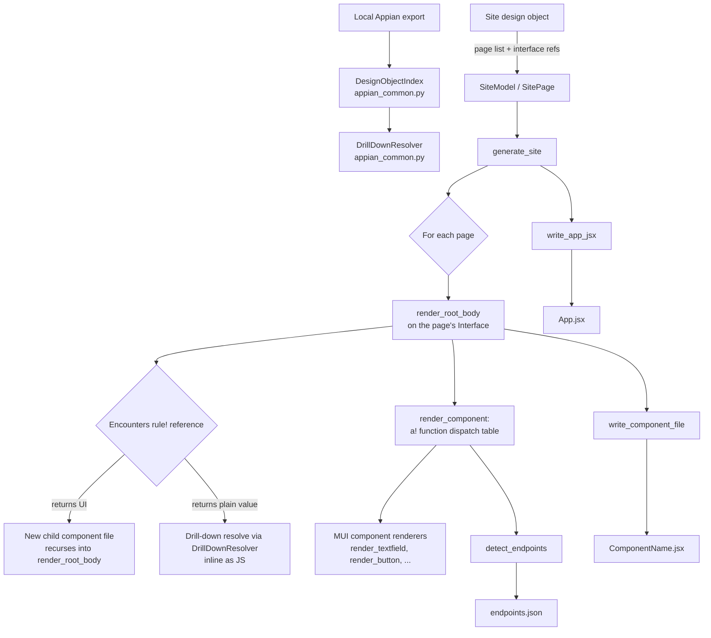

# Appian Site → React (MUI) Generator — Developer Guide

Companion reference for `appian_site_react_generator.py` (and the shared
engine it depends on, `appian_common.py`). This document explains exactly
how the converter works, end to end, and is exhaustive about what it does
**not** do — every generated file needs a developer to close out its TODOs
before it is production code.

---

## 1. What this tool is for

Given:
1. An Appian **Site** design object (a collection of pages, each pointing at
   an Interface), and
2. The local export of every **Interface** (and the Expression Rules /
   Constants / Integrations those interfaces reference),

...this tool produces:
- One React functional component (`.jsx`) per page, and one more per nested
  Interface that itself returns UI (so reusable Appian interfaces become
  reusable React components, not copy-pasted markup).
- An `App.jsx` wiring every page to a `react-router-dom` route matching its
  Appian URL stub.
- `endpoints.json` — every **backend touchpoint** the site depends on
  (record queries, process starts, Integration-object calls, and any literal
  URLs), so you know exactly which REST endpoints your Java backend needs to
  expose.
- `resolution_notes.json` — every unresolved reference and parser warning
  encountered, so nothing silently goes missing.

Components are wired to **MUI** (`@mui/material`, `@mui/x-data-grid`,
`@mui/x-date-pickers`).

---

## 2. Why Appian "endpoints" aren't URLs

This is the single most important conceptual point in this tool, and it
shapes the whole design: **Appian interfaces do not call raw HTTP URLs.**
SAIL has no generic "make an HTTP request" function reachable from an
interface. Instead, a button or field triggers one of:

| Appian mechanism | SAIL shape | What it becomes in your target architecture |
|---|---|---|
| Record data source | `a!queryRecordType(recordType: ..., filters: ...)` | A REST endpoint your Java backend exposes for that record type |
| Process start | `a!startProcess(processModel: ..., ...)` | A REST endpoint that kicks off the equivalent Java-orchestrated workflow |
| Integration object | `rule!SomeIntegrationObject(...)` where the referenced design object is an Integration | A REST endpoint wrapping whatever that integration used to call |
| Literal URL | A hardcoded `"https://..."` string, e.g. in a link field | Usually an external link, kept as-is |

So `endpoints.json` is not scraped URLs — it's a **worklist of backend
capabilities your new Java API needs to provide**, tagged by which
component/page depends on them. That's a more useful (and honest) artifact
for a migration project than pretending literal URLs exist where they don't.

---

## 3. Architecture



### 3.1 `appian_common.py` (shared with the Java node-converter suite)
- `DesignObjectIndex` — scans the local export directory, indexes every
  design object by name and UUID via permissive regex extraction (see
  Limitation #1 below).
- `DrillDownResolver` — recursively inlines `rule!`/`cons!` references in an
  expression until none remain resolvable, with memoization, cycle
  detection, and depth limiting. This generator reuses it **unchanged** —
  every plain-value expression (a field's `value:`, a `visibleWhen:`
  condition, a `local!` initializer, etc.) is drilled down exactly the same
  way a Script Task's expression was in the Java suite.
- `best_effort_translate` — a small set of primitive SAIL→text translations
  (`a!ifThenElse` → ternary, `concat(` → `String.join(...`, etc.), reused
  here and then further translated into JS-valid syntax (see 3.3).

### 3.2 `appian_site_react_generator.py` (this script)
Everything specific to Sites/Interfaces/React lives here, layered on top of
the shared engine:
- **Site/page parsing** (`load_site_from_report` / `parse_site_xml`)
- **Extended object classification** (`classify_extended`) — Sites,
  Interfaces, and Integrations aren't covered by `appian_common.py`'s
  `TYPE_HINTS` (which only knows about Rules/Constants/Decisions), so this
  file adds its own lightweight classifier, reading each object's raw
  export file directly.
- **The UI-vs-logic decision** (`is_ui_returning`) — see Section 5.
- **The SAIL call parser** — a minimal recursive-descent parser scoped to
  the fairly regular `a!func(name: value, ...)` grammar of UI component
  calls (see Section 4). This is *not* a full SAIL grammar/parser; that
  remains a larger undertaking noted in the original top-level migration
  plan.
- **Component renderers** — one function per MUI target (Section 6).
- **Reference translation** (`sail_refs_to_js`) — rewrites `pv!`/`ri!`/
  `local!`/`fv!`/`cons!` into valid JS (Section 7).
- **Endpoint detection** (`detect_endpoints`) — Section 2's table,
  implemented as regex scans run at every point an expression is resolved.

---

## 4. The SAIL call parser

Full SAIL is a real expression language (operators, lambdas, arbitrary
nesting) — parsing all of it correctly needs a proper grammar (ANTLR is the
practical route), which the original migration plan already flags as its
own phase. What this generator needs is much narrower: SAIL UI component
calls are almost always written as `a!functionName(paramName: value, ...)`
— a very regular shape. So instead of a full grammar, there are three small
building blocks:

- **`find_matching_paren(text, open_idx)`** — walks forward from an opening
  `(`, tracking nesting depth and string-literal state (so a `)` inside a
  quoted string doesn't end the call early), and returns the index of the
  matching `)`.
- **`split_top_level(text, sep=",")`** — splits a string on a separator,
  but only at nesting depth 0 (respecting `()`, `{}`, `[]`, and quoted
  strings) — so `a!map(a: 1, b: 2), "x, y"` splits into two parts at the
  outer comma, not four.
- **`parse_named_args(arg_string)`** — for each top-level chunk, finds the
  first top-level `:` and splits it into `{name: value}`; chunks with no
  colon become positional arguments (stored under `_positional`).

`parse_top_level_call(expr)` composes these: it checks whether an
expression starts with `a!name(` or `rule!name(`, and if so returns
`(prefix, name, argument_string)`.

This is deliberately permissive and works well for the regular cases. It
will **not** correctly parse every edge case of real SAIL syntax — see
Limitation #2.

---

## 5. The UI-vs-logic decision (`is_ui_returning`)

Every `rule!` reference found while rendering is classified one of two ways,
mirroring the same structural-vs-logic boundary the Java node-converter
suite used for subprocess calls vs. inlined expressions:

- **Returns UI** → treated as a reusable component. A new `.jsx` file is
  generated (once — subsequent references reuse it), and the call site
  becomes `<ComponentName someProp={...} />`.
- **Returns a plain value** (string, number, boolean, record) → treated as
  business logic. Its body is drilled down via `DrillDownResolver` exactly
  like a Script Task expression, and inlined as a JS expression.

The decision itself:
```python
def is_ui_returning(obj):
    if classify_extended(obj) == "interface":
        return True
    expr = (obj.raw_expression or "").strip()
    return any(expr.startswith(f) for f in UI_ROOT_FUNCS)
```
i.e., an object is UI-returning if it's *typed* as an Interface design
object, **or** if its expression's outermost call is a known layout function
(`a!formLayout`, `a!sectionLayout`, `a!cardLayout`, etc.). This heuristic has
a real failure mode — see Limitation #4.

---

## 6. Component mapping reference

| Appian function | Rendered as | MUI import(s) |
|---|---|---|
| `a!formLayout` | `<Box component="form">` | `Box` |
| `a!sectionLayout` | `<Paper variant="outlined">` | `Paper` |
| `a!columnsLayout` | `<Grid container spacing={2}>` | `Grid` |
| `a!columnLayout` | `<Grid item xs={12} md>` | `Grid` |
| `a!cardLayout` | `<Card><CardHeader/><CardContent>` | `Card`, `CardContent`, `CardHeader` |
| `a!headerContentLayout`, `a!sideBySideItem` | `<Box>` | `Box` |
| `a!sideBySideLayout` | `<Stack direction="row">` | `Stack` |
| `a!tabsLayout` | `<Tabs>`/`<Tab>` + conditional panels, with a `useState` hook for the active tab | `Tabs`, `Tab` |
| `a!buttonArrayLayout` | `<Stack direction="row">` | `Stack` |
| `a!textField` | `<TextField fullWidth>` | `TextField` |
| `a!paragraphField` | `<TextField multiline minRows={3}>` | `TextField` |
| `a!dropdownField` | `<TextField select>` + `<MenuItem>` per choice | `TextField`, `MenuItem` |
| `a!checkboxField` | `<FormControlLabel control={<Checkbox/>}>` | `FormControlLabel`, `Checkbox` |
| `a!radioButtonField` | `<FormControl><RadioGroup>` + `<FormControlLabel control={<Radio/>}>` per choice | `FormControl`, `FormLabel`, `RadioGroup`, `FormControlLabel`, `Radio` |
| `a!dateField` | `<DatePicker>` (needs `LocalizationProvider` — see Limitation #15) | `DatePicker` (`@mui/x-date-pickers`) |
| `a!fileUploadField` | `<Button component="label">` + hidden `<input type="file">` | `Button` |
| `a!buttonWidget` | `<Button variant="contained">` + generated `onClick` handler stub | `Button` |
| `a!richTextDisplayField` | `<Typography>` | `Typography` |
| `a!gridField` | `<DataGrid rows=... columns=...>` | `DataGrid` (`@mui/x-data-grid`) |
| `a!imageField` | `` | — |
| `a!linkField` | `<Link href="...">` (literal URI) or `<Link component="button">` (action) | `Link` |
| `a!dynamicLink` | `<Link component="button">` + handler stub | `Link` |
| `a!milestoneField` | `<Stepper><Step><StepLabel>` | `Stepper`, `Step`, `StepLabel` |
| anything else | `<div data-appian-fn="...">` with a `TODO` comment and raw args dumped | — |

Imports are tracked per-file via `use_import()` during rendering and emitted
grouped by package (`@mui/material`, `@mui/x-data-grid`,
`@mui/x-date-pickers/DatePicker`) — only what's actually used in that file.

---

## 7. Reference translation

| SAIL | JS | Notes |
|---|---|---|
| `pv!name` | `props.name` | Process variable → treated as a prop passed into the page component |
| `ri!name` | `props.name` | Rule input → also treated as a prop (see Limitation #3 for the real gap this creates) |
| `local!name` | matching `useState` variable name | Only correctly wired when the `local!` was declared via `a!localVariables` in the SAME interface (see Section 8) |
| `fv!row.field` | `row.field` (or `params.row.field` specifically inside a DataGrid `valueGetter`) | Loop/row variable from a grid or `a!forEach` |
| `cons!Name` | `Constants.Name` | Should rarely survive — the resolver normally inlines constants already; this is a fallback for anything it couldn't resolve |
| `` a & b `` (SAIL text concatenation) | `a + b` | Safe rewrite — SAIL has no boolean `&` operator |

---

## 8. `a!localVariables` handling

Appian interfaces very commonly start with:
```
a!localVariables(
  local!x: <init>,
  local!y: <init>,
  <actual UI tree>
)
```
`render_root_body` detects this pattern specifically, and:
1. Turns every `local!name: init` pair into
   `const [name, setName] = React.useState(<drilled-down init>);` at the top
   of the component function.
2. Renders the final (non-`local!`) argument as the component's returned
   JSX.

Any `local!name` reference elsewhere in the tree is rewritten to the same
camelCase variable name by `sail_refs_to_js`, so references stay consistent
with the hook declaration — **as long as** the reference is within the same
component (nested child components get their own `props`, not the parent's
locals — see Limitation #3).

---

## 9. Output files

For a site with pages P1, P2 and one shared nested interface I1:
```
output/
  P1.jsx
  P2.jsx
  I1.jsx              # generated once, imported by whichever page(s) use it
  App.jsx             # react-router-dom routes for P1 and P2
  endpoints.json       # deduplicated backend touchpoints, tagged by component
  resolution_notes.json  # unresolved refs + parser warnings
```

---

## 10. CLI reference

```bash
# Self-contained demo -- no real data needed, proves the whole pipeline
python appian_site_react_generator.py --demo

# Inspect one real exported XML file to calibrate the parser before a real run
python appian_site_react_generator.py --inspect /path/to/some_interface.xml

# Real run
python appian_site_react_generator.py \
    --export-root /path/to/local/appian_export \
    --site-report /path/to/site_report.json \
    --out-dir ./react_output
```
`--site-report` expects:
```json
{
  "name": "Customer Portal",
  "pages": [
    {"name": "Account Details", "urlStub": "account-details", "interfaceRef": "accountDetailsInterface"}
  ]
}
```
If you'd rather point `--export-root` at the raw exported Site XML instead
of building this JSON by hand, `parse_site_xml()` provides a permissive
fallback parser — calibrate it against `--inspect` the same way as
`DesignObjectIndex`.

---

## 11. Extending the generator

- **Add a new component mapping**: add an entry to `FUNC_TO_KIND` pointing
  at a new `kind` string, write a `render_<kind>(args, ctx)` function
  following the existing ones as a template, and register it in
  `COMPONENT_RENDERERS`.
- **Add a new backend-touchpoint pattern**: add a regex block to
  `detect_endpoints()`.
- **Change MUI usage for an existing component**: edit its `render_*`
  function directly — imports are tracked automatically via `use_import()`,
  so you don't need to touch `write_component_file()`.

---

## 12. Known Limitations (read before relying on generated output)

1. **XML parsing is permissive, not a real parser.** `DesignObjectIndex`
   (shared with the Java suite) and `classify_extended` in this file use
   regex against raw export XML because the exact export schema wasn't
   verified against a real file. Run `--inspect` on a real Site and a real
   Interface export first.

2. **The SAIL call parser is scoped, not complete.** It handles the regular
   `a!func(name: value, ...)` shape well, but does **not** implement full
   SAIL syntax: complex nested lambdas (e.g. multi-variable `a!forEach`),
   unusual whitespace/comment placement, or purely positional-argument calls
   beyond the simple cases may not parse as expected. Anything it can't
   parse falls through to the "unmapped" `<div>` placeholder or gets
   spliced in as a raw comment rather than silently guessed at.

3. **Rule-input binding is not implemented — this is the most important
   correctness gap.** When a business-logic rule like
   `rule!isEligible(balance: pv!currentBalance)` gets inlined, its body's
   own `ri!balance` reference is rewritten to `props.balance` by the
   generic `ri!` → `props.*` rule — **not** to `props.currentBalance`,
   which is what was actually passed. Since both `pv!` and `ri!` map to
   `props.*`, this only produces a *correct* result by coincidence (when the
   names happen to match). Every inlined business-logic rule call needs a
   developer to check that the resulting `props.*` references actually line
   up with what the call site passed in. The same gap exists for nested
   `local!` references inside an inlined rule body (they won't resolve to
   any `useState` var, since the hook only exists in the component that
   declared it).

4. **The UI-vs-logic heuristic can misclassify.** `is_ui_returning` only
   recognizes a rule as UI if its *outermost* call is a known layout
   function. A rule like `a!ifThenElse(cond, a!textField(...), null)` has
   `a!ifThenElse` as its outermost call — not in the known list — so it gets
   classified as business logic and inlined as a JS ternary containing
   embedded pseudo-JSX text, which will not compile. Any rule that
   conditionally returns different UI trees needs manual review.

5. **Data-fetching is a placeholder, not implemented.** `a!queryRecordType`
   and similar produce `{/* TODO: fetch via REST endpoint */ null}` — no
   `useEffect`/`fetch`/React Query call is generated. This is intentional
   (see Section 2) but means every data-bound field/grid needs real
   data-fetching wired in before it will render anything.

6. **Choice lists only resolve when fully literal.** `extract_choice_options`
   only handles `choiceLabels`/`choiceValues` that are literal string/number
   arrays. Record-backed or rule-computed choices (very common in real
   Appian apps) produce a `<MenuItem>` TODO instead of real options.

7. **Grid columns assume flat field access.** `a!gridColumn`'s `value` is
   translated as a flat expression. A column whose `value` is itself another
   UI component call (e.g. a status badge rendered per-row) is not specially
   handled — it will be run through the same JS translation as a plain
   value expression, which likely won't produce valid JSX for a cell
   renderer.

8. **Styling is approximate, not ported.** SAIL style tokens (`shape`,
   `size`, spacing constants like `"STANDARD"`/`"DENSE"`, background colors)
   are **not** translated to MUI `sx` props. Generated layouts use sensible
   generic defaults (`p: 2`, `spacing: 2`) rather than reproducing the
   original interface's visual density or theme. A pixel-accurate design
   port is out of scope for this tool.

9. **No accessibility metadata is carried over.** Appian's
   `accessibilityText` / `instructions` parameters are not mapped to
   `aria-*` attributes beyond whatever MUI provides by default.

10. **Field-level validation is not converted.** Appian's `validations:` /
    `validationGroup` parameters are ignored — generated fields render but
    enforce no client-side validation. Wiring a validation library
    (`react-hook-form` + `yup`/`zod` is the common MUI-ecosystem pairing) is
    a follow-on task.

11. **Conditional visibility (`showWhen`) is not handled at all.** It is
    currently not read by any component renderer — a field that Appian
    would hide is generated as always-visible React. This is a gap worth
    prioritizing in a follow-on pass, since `showWhen` is extremely common
    in real Appian interfaces.

12. **No cross-component state management is generated.** Every `useState`
    hook is local to its own component. Appian's process-variable scoping
    (shared across an entire process/session) has no equivalent here —
    passing data between sibling pages or deeply nested components needs a
    real architecture decision (Context, Redux, Zustand, URL state, etc.)
    that this tool does not make for you.

13. **No authentication, routing guards, or role-based visibility.** Appian
    group-based security on pages/fields is not detected or reproduced.
    `App.jsx`'s routes are open by default.

14. **`@mui/x-data-grid`'s free (Community) tier has feature limits.** If
    any converted grid used Appian features like grouping, aggregation, or
    pivoting, note that those live in DataGrid Pro/Premium, which are
    separately licensed from MUI — a procurement question worth raising
    early, not after 500+ interfaces are converted.

15. **`DatePicker` needs manual setup.** `@mui/x-date-pickers` requires a
    date adapter (commonly `date-fns` or `dayjs`) wrapped in a
    `<LocalizationProvider>` at the application root. The generator emits a
    reminder comment above every `<DatePicker>` but does **not** wire
    `LocalizationProvider` into `App.jsx` automatically — do this once,
    manually, before any generated `DatePicker` will render.

16. **Generated code is a scaffold, not a finished product.** Every `TODO`
    comment marks something a developer must resolve. Running ESLint and
    TypeScript (or `prop-types`) checks over the generated output as a
    follow-on gate, before anything reaches a real environment, is strongly
    recommended — the same discipline already established for the Java
    conversion scripts (parity testing against real Appian behavior before
    cutover).

---

## 13. Recommended next steps

Roughly in priority order, based on which limitation above causes the most
silent incorrectness if skipped:

1. Parse each referenced rule's `ruleInputs` signature (not just its body)
   so `rule!x(balance: pv!y)` calls can correctly rewrite the inlined body's
   `ri!balance` to `pv!y` — closes Limitation #3, the most important one.
2. Add `showWhen` detection and translate it to a conditional render
   (`{condition && (...)}`) — closes Limitation #11.
3. Wire real data-fetching (React Query is the natural fit alongside MUI)
   against the endpoints your Java backend actually exposes, once that
   backend exists.
4. Extend the UI-vs-logic heuristic to look inside common conditional
   wrappers (`a!ifThenElse`, `a!match`) for a nested UI-root call, rather
   than only checking the outermost call — closes Limitation #4.
5. Add validation-rule translation once the target validation library is
   chosen.
